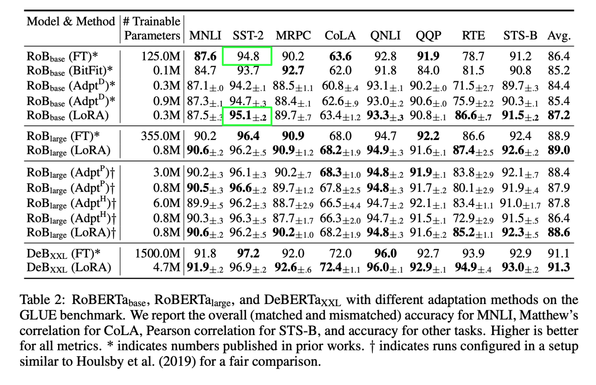

# Fine-tuning RoBERTa 2 on GLUE-SST2 using LoRA

This is a low-level implementation of [Low-rank Adaptation (LoRA)](https://arxiv.org/pdf/2106.09685) for fine-tuning RoBERTa 2 on GLUE-SST2.

RoBERTa is a pre-trained model which can be fine-tuned on downstream tasks, such as sentiment analysis, text classification, and text generation.

Traditional fine-tuning involves training all the model parameters. LoRA achieves the same objective by training a much smaller set of parameters, but still gives equal or better result on downstream task, using much lower computational resources and no added inference latency.

I chose binary text classification as the downstream task. Particularly, I used the GLUE-SST2 (Stanford Sentiment Treebank) dataset.

In the first notebook `roberta.ipynb`, I attempted to replicate result from the [RoBERTa paper](https://arxiv.org/pdf/1907.11692) by Liu et al. (2019) by doing a full fine-tuning of RoBERTa on SST2.

After that, I fine-tuned the model for the same objective using LoRA in `lora.ipynb`. This file uses some custom modules in the `lora_modules.py` file.

These notebooks try to replicate the two figures highlighted in green below from the LoRA paper:

